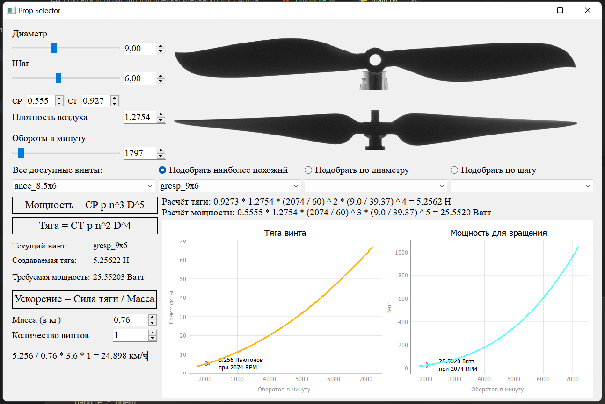

##  Подбор и автоматизированный расчёт характеристик воздушных винтов

Цель дипломной работы - разработка программного обеспечения для удобного анализа харктеристик и подбора воздущных винтов мультироторных беспилотных систем.  

  

Реализованы три алгоритма подбора:  
 * По соотвествию диаметру
 * По соответстивю шага винта
 * По обоим параметра  
  
Производится расчёт тяги только для статических условий. 
Формулы используемые для расчёта:  
```
T = tk * p * n² * d⁴  
N = pk * p * n³ * d⁵  
```
Где T- тяга, N - мощность  
  
Коэффиценты тяги и мощности взяты из измерений Департамента аэрокосмической техники и Университета Иллинойс в Урбана-Шампейн в США.  
Сайт с датасетами: https://m-selig.ae.illinois.edu/props/propDB.html  
Из всего датасета используются данные о 218 винтах.  
